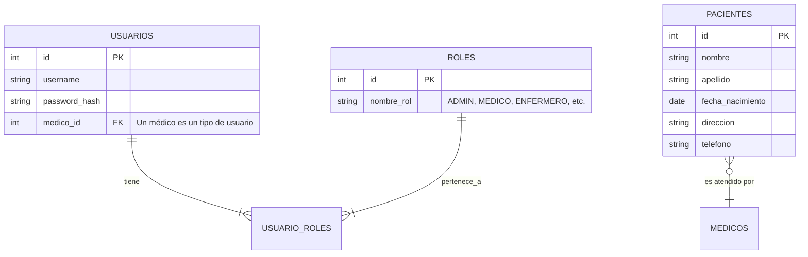

# Sistema de Gestión Médica

Este proyecto es un cliente de escritorio desarrollado en JavaFX que sirve como interfaz para un sistema de gestión médica más grande. La aplicación se conecta a un servidor backend para manejar la autenticación de usuarios, la gestión de pacientes y otras funcionalidades críticas.

## Características Principales

-   **Autenticación Segura:** Sistema de inicio de sesión y registro de usuarios para proteger el acceso a los datos.
-   **Control de Acceso Basado en Roles:** Diferentes usuarios tienen distintos niveles de acceso y permisos dentro de la aplicación.
-   **Gestión de Pacientes:** Funcionalidades para crear, ver, y modificar la información de los pacientes.
-   **Interfaz de Usuario Moderna:** Construida con JavaFX y la librería JFoenix para una experiencia de usuario fluida.

## Requisitos Previos

-   **Java Development Kit (JDK):** Versión 17 o superior.
-   **Servidor Backend:** Es **indispensable** tener una instancia del servidor backend corriendo localmente en `http://localhost:8080`. Este cliente no funcionará sin él.

## Instalación y Ejecución

Una vez que hayas clonado el repositorio, puedes compilar y ejecutar el proyecto usando el Maven Wrapper incluido.

1.  **Compila el proyecto:**
    ```bash
    # En Mac/Linux
    ./mvnw clean install

    # En Windows
    .\mvnw.cmd clean install
    ```

2.  **Ejecuta la aplicación:**
    ```bash
    # En Mac/Linux
    ./mvnw javafx:run

    # En Windows
    .\mvnw.cmd javafx:run
    ```

## Diagrama de Base de Datos (Modelo Lógico)

El siguiente diagrama ilustra la relación entre las entidades principales de la base de datos que da soporte a la aplicación.



## Arquitectura y Funcionamiento

La aplicación sigue una arquitectura cliente-servidor de tres capas que separa la presentación, la lógica de negocio y el acceso a datos.

```mermaid
graph TD
    subgraph "Cliente (JavaFX App)"
        A[Vistas (FXML)]
        B[Controladores]
        C[Servicios de Cliente]
    end

    subgraph "Servidor Backend (Spring Boot)"
        D[API Endpoints (REST Controllers)]
        E[Lógica de Negocio (Services)]
        F[Acceso a Datos (Repositories)]
    end

    subgraph "Base de Datos"
        G[(Database)]
    end

    A -- "Interacción del Usuario" --> B
    B -- "Llama a" --> C
    C -- "Petición HTTP (JSON)" --> D
    D -- "Invoca a" --> E
    E -- "Usa" --> F
    F -- "Consulta/Actualiza" --> G
```

## Tecnologías Utilizadas

-   **Lenguaje:** Java 17
-   **Framework de UI:** JavaFX
-   **Librerías de UI:** JFoenix
-   **Gestión de Dependencias:** Maven
-   **Cliente HTTP:** OkHttp
-   **Manejo de JSON:** Gson
-   **Framework de Aplicación:** Spring Boot